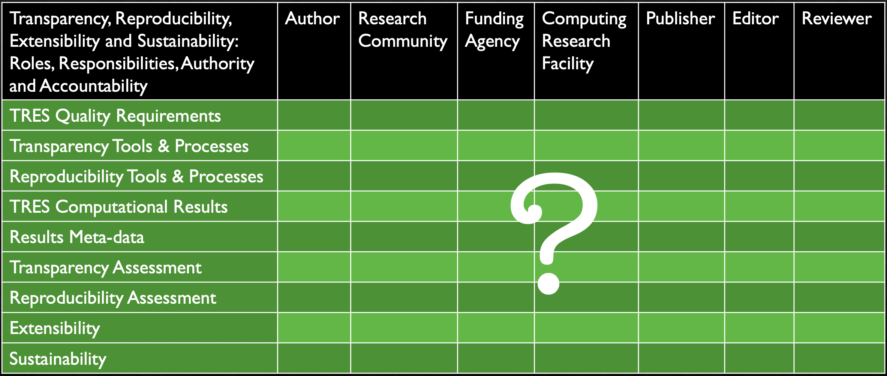

## TRES-2020 Home

### 2020 Virtual TRES Workshop

- Dates TBD.
- Contact: Mike Heroux <maherou@sandia.gov>, +1 505 379 5518

### Details
- [**Agenda**](Agenda.md)
- [**Background**](Background.md)
- [**Workshop Goals and Format**](GoalsFormat.md)
- [**Organizers**](Organizers.md)
- [**Resources**](Resources.md)

<!--
- [**Workshop Venue**](Venue.md)
- [**Transportation**](Transportation.md)
- [**Campus Map**](SJU-Campus-Map.pdf)
- [**Campus Code-of-Conduct Policy**]()
- [**Detailed Agenda**](TRES-2020-Agenda.pdf)
- [**White Papers**](WorkshopResources/WhitePapers/WhitePaperList.md)
- [**All White Papers: WhitePapersBundle.zip**](WorkshopResources/WhitePapersBundle.zip)
- [**Presentations**](WorkshopResources/Presentations/PresentationList.md)
- [**All Presentations: PresentationsBundle.zip**](WorkshopResources/PresentationsBundle.zip)
- [**Attendees**](Attendees.md)
- [**Discussion Groups**](DiscussionGroups.md)
- [**Ride Sharing**](Ride_sharing.md)
- [**Workshop Registration and Housing Reservations**](Registration.md)
-->
